# Data Analyst Tech Setup 

## Software 

### Git Bash
- Download 64-bit Git for Windows Setup [here](https://git-scm.com/download/win). 

- After the file has downloaded, click on the installer. Accept all the defaults, but on the second page, add a GitBash icon to your desktop for easy access.

- Open the GitBash application. You should see something like this. 

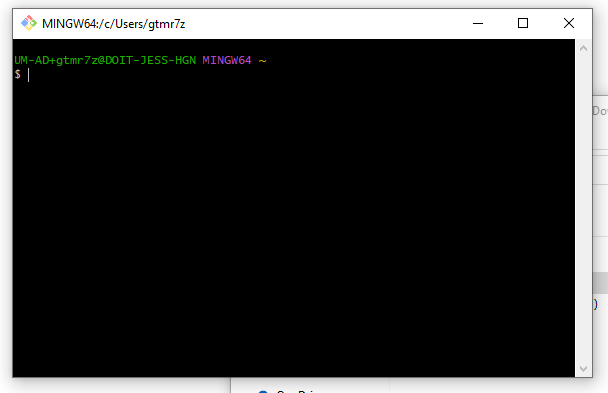

- Run the command `pwd` to confirm everything is configured properly. You should see something like this. 

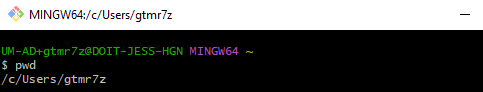

### Visual Studio Code 
- Download Visual Studio Code for Windows [here](https://code.visualstudio.com/). 

- Click on the installer. Accept the agreement. Select all of options on the second page. Install the application. 

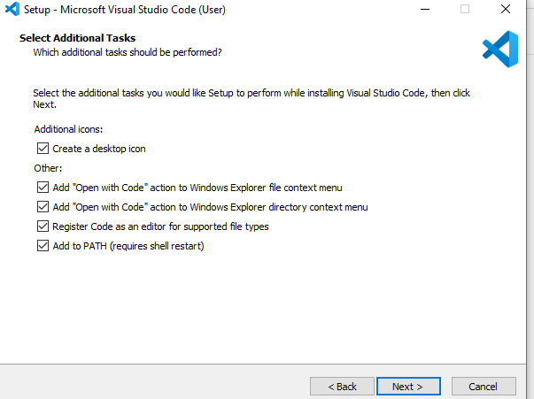

### Python3 
- Normally, you should download the latest version of python3 from [here](https://www.python.org/downloads/), (double check you downloaded the windows version, but the ones from the yellow button on home screen should automatically select that). 

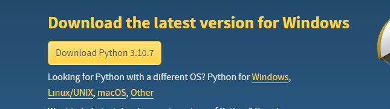

- If you are prompted to enter admin credentials, and you do not have admin access, you should be able to download python3 from the windows store. 

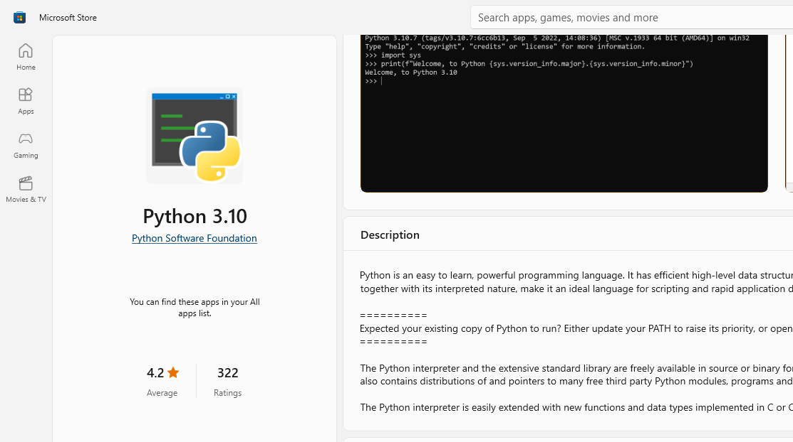

- After completing installation, confirm you have the latest python3 installed by closing out of GitBash. Reopen GitBash and run the command `python --version`. You should see something like this. 

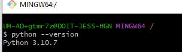

## Development
- If you don't already, request access to the [MU News Bureau Github](https://github.com/MU-News-Bureau). At a minimum, you will need write access to be able to clone, pull, and push to the repositories. 

- Once you have access to the Github organization, you will need to clone the repository. Open up the terminal in VSCode, as shown below.

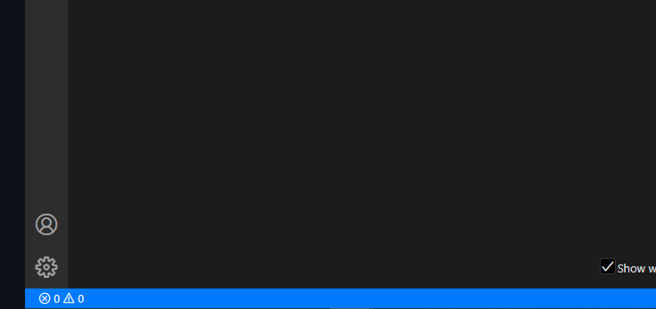

- Click in the area where you can see the 'X" and caution image. Something like the image below should appear.

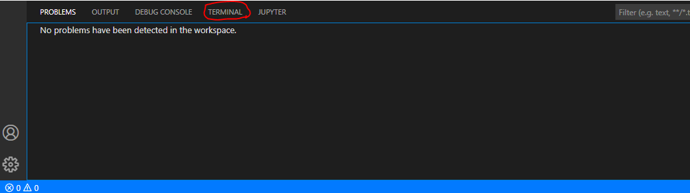

- Click on the text 'Terminal' circled in red above. You should see something on your screen like this. 

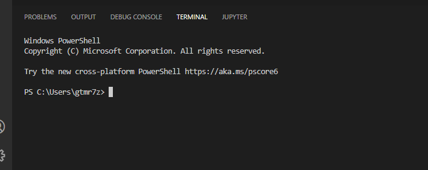

- Run the command `git clone ` followed by the URL of the github repository you are trying to download. The response you recieve should look like this. Make sure to navigate to the correct directory where you want this repository. I already had this repo downloaded, which is why it is installed to my user; you will likely not want your repo cloned to this directory.

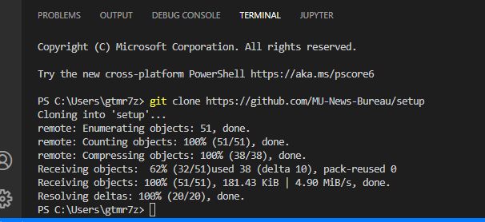

- Go the directory you cloned the repositiory into using File Explorer. You should see it there, like demonstrated in the image below; the repo is emphasized using red marker.

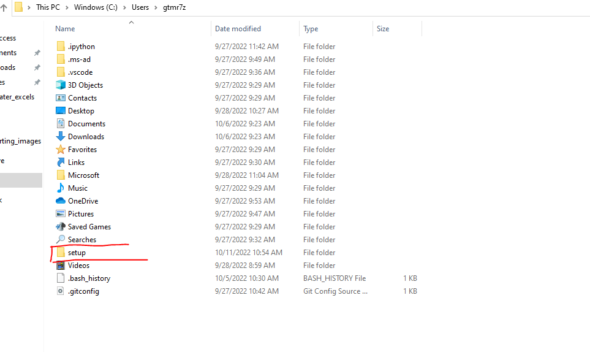